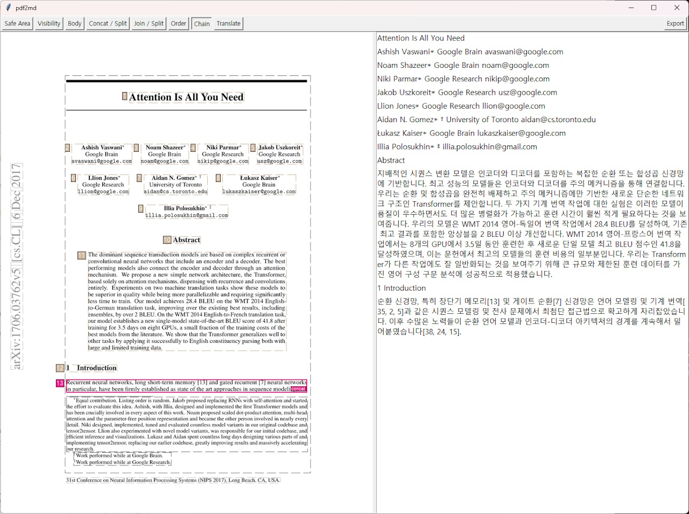

# pdf2md
This project, pdf2md, transforms academic paper PDF files into digestible text files. By analyzing the layout of the PDF file, the application restructures paragraphs and translates desired content. The final result is a conveniently exported text file.


## Setup
We recommend setting up a virtual environment for running the application. This can be done with the following commands:

```
python -m venv .venv

# Activate the virtual environment depending on your platform
# Windows
source .venv/bin/activate

# linux
source .venv/bin/activate   # or
. .venv/bin/activate
```

Next, install the required Python packages:
```


# pdf2md

`pdf2md` 是一款面向科研 PDF 的可视化处理工具，可完成扫描版 OCR、交互式段落管理、翻译、结构化 Markdown 导出与知识图谱生成，帮助快速整理和理解论文内容。

## 核心特性

- **交互式 PDF 查看器**：左侧渲染原始页面，右侧同步显示段落及译文。
- **扫描版 OCR**：基于 Tesseract 自动识别纯图片 PDF，输出可编辑的正文。
- **翻译工作流**：支持 DashScope/Qwen 兼容的 OpenAI SDK，并可配置 RapidAPI DeepL 作为优先翻译源。
- **结构化 Markdown 导出**：按照当前可见正文导出层次清晰的 Markdown。
- **知识图谱生成**：读取 Markdown 内容提取实体关系，输出交互式 HTML 图谱。
- **段落整理工具栏**：安全区域调整、正文切换、顺序重排、可见性过滤等操作一应俱全。

## 环境准备

- Python 3.12
- [Tesseract OCR](https://tesseract-ocr.github.io/)（需保证命令行可调用）
- 可选：DashScope / OpenAI / RapidAPI DeepL 的密钥，用于翻译与图谱生成

### 安装步骤

```bash
git clone <your-repo-url>
cd pdf2md-master

python -m venv .venv
source .venv/bin/activate  # Windows 请使用 .venv\Scripts\activate

pip install -r requirements.txt
```

创建 `.env` 文件（示例）：

```env
CACHE_DIR=./cache
EXPORT_DIR=./export
PROMPT_DIR=./prompt

TEXT_FONT=tkDefaultFont
TEXT_FONT_SIZE=11

# RapidAPI DeepL（可选）
DEEPL_RAPID_API_KEY=your_rapidapi_key
DEEPL_RAPID_API_HOST=deepl-translator.p.rapidapi.com
DEEPL_RAPID_API_SRC_LANG=EN
DEEPL_RAPID_API_DST_LANG=ZH

# DashScope / OpenAI 兼容接口（可选）
OPENAI_API_KEY=your_dashscope_key
OPENAI_MODEL=qwen3-max
DASHSCOPE_API_URL=https://dashscope.aliyuncs.com/compatible-mode/v1
```

在 Debian/Ubuntu 上安装 Tesseract：

```bash
sudo apt-get install tesseract-ocr tesseract-ocr-eng
```

## 启动应用

```bash
python -m src.main --f /path/to/document.pdf
```

常用参数：

- `--i` 重新解析 PDF（忽略缓存）
- `--l` 列出所有可用字体后退出

支持直接输入 Arxiv 或 HuggingFace 论文页链接，程序会自动转换为对应 PDF 地址。

## 界面操作速览

- **Safe Area**：拖动红框限定整篇文档的有效内容区域。
- **Body**：点击段落切换是否视为正文，直接影响翻译和导出结果。
- **Order**：先选锚点再点击其他段落，可调整阅读顺序。
- **Translate**：点击段落触发翻译，译文会插入到右侧文本窗。
- **Export MD**：基于当前可见正文生成结构化 Markdown。
- **Export Translations**：导出当前页的原文/译文 HTML。
- **Show Translations Image**：生成包含译文的 PNG 预览，解决字体兼容问题。
- **Generate KG**：读取最近导出的 Markdown，生成知识图谱 HTML。

## 输出位置

- Markdown：`<EXPORT_DIR>/<pdf-name>_structured.md`
- 翻译 HTML：`<EXPORT_DIR>/<pdf-name>_page<index>_translations.html`
- 知识图谱：`<EXPORT_DIR>/<pdf-name>_knowledge_graph.html`

解析缓存存放于 `CACHE_DIR`，可手动删除或使用 `--i` 参数刷新。

## 常见问题

- **无 PDF 画面**：确认 Tesseract 安装成功且缓存目录可写；必要时删除同名 `.context` 文件后重试。
- **翻译失败**：检查 `.env` 中密钥是否正确，并查看终端输出的具体错误。
- **知识图谱为空**：请先成功导出 Markdown，确认文本中包含可识别的实体信息。

## 许可证

详见仓库内 `LICENSE` 文件。欢迎在遵循协议的前提下扩展或二次开发。
- Extraction of tables in the PDF.
- Proper parsing or image extraction of equations in the PDF.
- Automatic identification and modification of text attributes such as title, subtitle, and body text through font analysis.
- Export to markdown (md) files with formatting.
- Export to MHTML files, including images, tables, and equations.

python -m src.main --f /home/lrj/下载/pdf2md-master/test.pdf